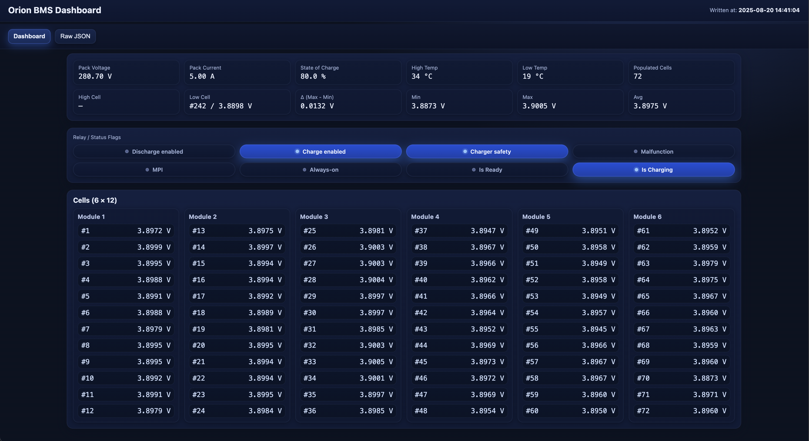

# WE OpenEV-CAN (working name)

## Current status

    - Solution working but needs tuning af can frames and gui fixes.
    - Also a set of robust boot and service scripts to start everyting as the system commes online.

## Project Overview  

This project documents and implements a **custom EV information system** built around:  
- **Orion BMS 2**  
- **Tesla Model 3 Rear Drive Unit (RDU)**  
- **Raspberry Pi 5 with CAN interface**  

The goal is to create a working **software and hardware architecture** for capturing, decoding, storing, and visualizing **CANBUS data** from the battery and drive unit.  

---

## What it does  
- Reads raw CAN messages from Orion BMS and Tesla RDU  
- Decodes useful values (voltages, currents, SOC, temperatures, inverter data)  
- Stores and structures data for later analysis  
- Provides a base for real-time dashboards or integration into other systems  

---

## Scope  
This is primarily a **personal engineering project**, shared openly:  
- Code and architecture are **free to copy, reuse, and adapt**  
- Not intended as a polished product or full open-source ecosystem (at least for now)  
- May serve as inspiration or foundation for others building DIY EV projects  

---

## Hardware Setup  
- Raspberry Pi 5 + PiCAN2 Duo (or similar CAN HAT)  
- Orion BMS 2  
- Tesla Model 3 Rear Drive Unit (RDU)  

---

**Tagline:**  
*EV information system using Orion BMS, Tesla Model 3 RDU, and Raspberry Pi CANBUS.*
