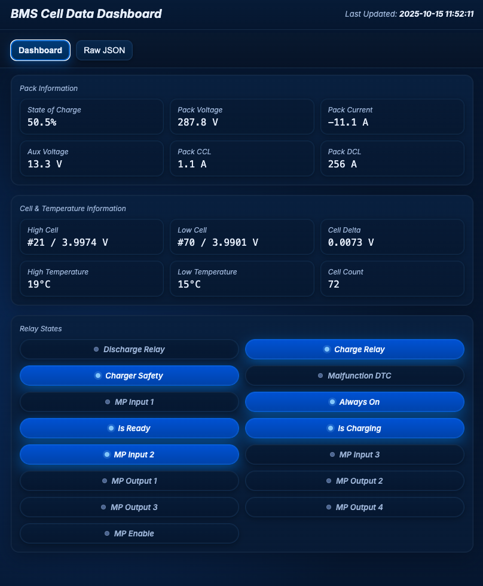

# WE-EV-CAN-Dashboard

This project is a modular CAN bus dashboard system for a DIY EV build using a Raspberry Pi and Orion BMS 2. It is written in Go and uses NATS as the internal message bus to decouple components.




## 🧩 Architecture Overview

The project is split into three main services:

1. **CAN Reader**

   * Listens on `can0`
   * Publishes raw CAN frames (with timestamps) to NATS (`can.raw`)
   * Logs all raw traffic to JSON-formatted logfile

2. **Message Handler**

   * Subscribes to `can.raw`
   * Decodes / processes messages
   * Saves parsed messages to JSON for frontend use

3. **Web UI**

   * Reads JSON files
   * Presents data via a basic HTML/JS frontend

4. **Relpay**

```
make replay
./bin/replay
```


   * To replay the messages on the logs/can_raw_sample.log file and put them on the message buss

---

## 🚀 Getting Started

### 📦 Prerequisites

* Go 1.21+
* Docker (for running NATS)
* SocketCAN support (Linux)
* CAN interface set up as `can0`

### 🔧 Installation

Clone the repo:

```bash
git clone https://github.com/YOUR_USERNAME/WE-EV-CAN-Dashboard.git
cd WE-EV-CAN-Dashboard
```

Install Go dependencies:

```bash
go mod tidy
```

---

## 🛰️ Running NATS (Local Dev)

### Option 1: Docker (Recommended)

```bash
docker run -p 4222:4222 --name nats-server -ti nats:latest
```

### Option 2: Native Install (macOS/Linux)

```bash
brew install nats-server
nats-server
```

### Option 3: Docker-compose
```bash
> docker compose up -d
> docker compose down
> docker compose logs -f
```


---

## ⚙️ Compile and Run Services

### 1. CAN Reader

Build and run:

```bash
make reader
./bin/reader
```

### 2. Message Handler

```bash
make handler
./bin/handler
```

### 3. UI

```bash
make ui
./bin/ui/ui
```

To build every component at once, run `make build`. Binaries and UI assets will be created under `bin/`.

---

## 🧪 Testing

You can test the system using replay files (to be implemented) or simulated CAN traffic.

---

## 📁 Config File

Create a `config.yaml` in the project root:

```yaml
logs:
  raw_file: logs/can_raw_20250916.log
  service_log: logs/reader_service.log
```

When the services are installed via `make install`, the working directory is `/opt/wecan`, so these relative paths resolve to `/opt/wecan/logs/...`.

---

## 📜 License

MIT License

# Install

## CAN Bus System Services Setup

### File Locations
- **Reader executable**: `/opt/wecan/bin/reader`
- **Handler executable**: `/opt/wecan/bin/handler`
- **UI executable**: `/opt/wecan/bin/ui/ui`
- **Service log**: `/opt/wecan/logs/reader_service.log`
- **CAN capture log (via `-l`)**: `/opt/wecan/logs/canbus.json`
- **Telemetry JSON data**: `/opt/wecan/data/*.json`
- **Reader service**: `/etc/systemd/system/canbus-reader.service`
- **Handler service**: `/etc/systemd/system/canbus-handler.service`
- **UI service**: `/etc/systemd/system/canbus-ui.service`
- **Configuration**: `/opt/wecan/config.yaml`

### Build and Install Services
```bash
# Build, install to /opt/wecan, copy config/data, and restart services
sudo make install
```

### Service Management
```bash
# Check all service status
sudo systemctl status canbus-reader canbus-handler canbus-ui

# View live logs
sudo journalctl -u canbus-reader -f
sudo journalctl -u canbus-handler -f
sudo journalctl -u canbus-ui -f

# Stop all services
sudo systemctl stop canbus-reader canbus-handler canbus-ui

# Start all services
sudo systemctl start canbus-reader canbus-handler canbus-ui

# Restart all services
sudo systemctl restart canbus-reader canbus-handler canbus-ui

# Disable auto-start on boot
sudo systemctl disable canbus-reader canbus-handler canbus-ui
```

### Access the Web UI
Once all services are running, access the dashboard at: http://localhost:8080
